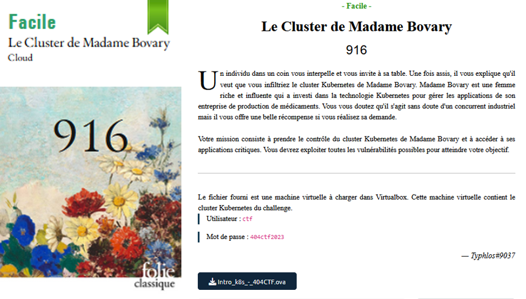
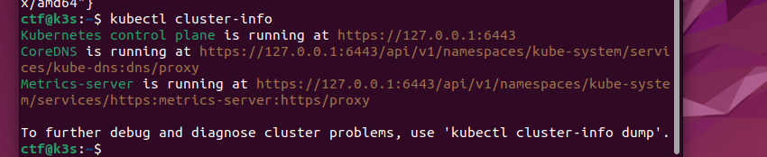
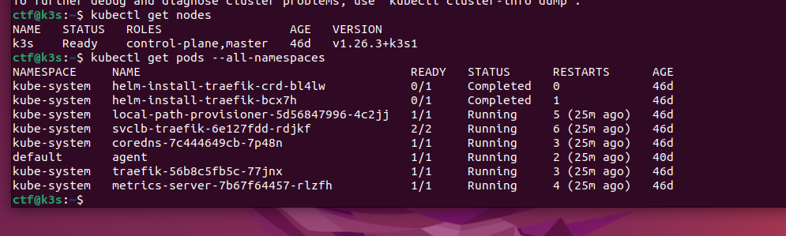
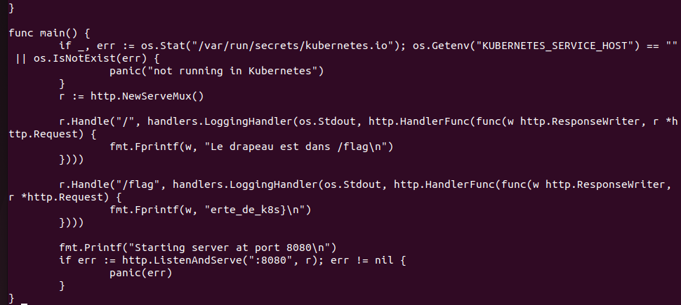
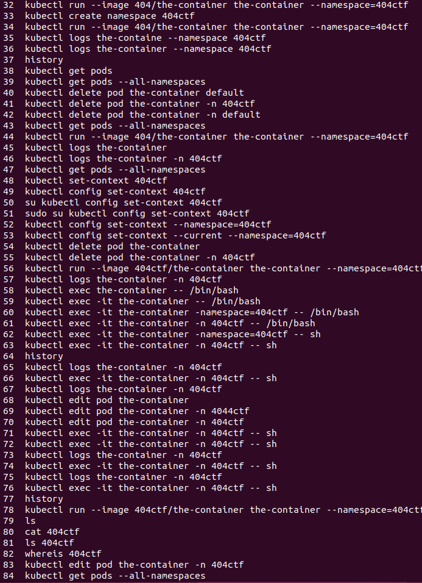
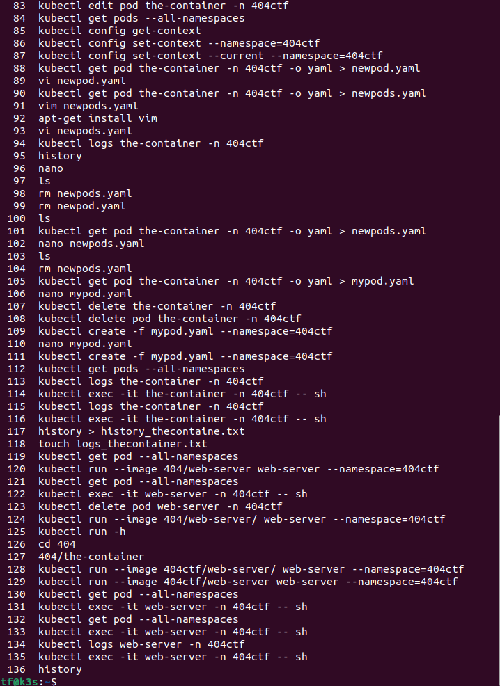

# Cloud - Le cluster de Madame Bovary
## Challenge description



## Resolution

Comme je ne connais pas Kubernetes, j'ai testé différentes commandes. J'ai aussi supprimé tout donc je n'ai que les screenshots que j'ai fais sur le coup.





Au bout d'un moment je me rends compte qu'il n'y a qu'un seul pod dans le namespace : `agent`.

En regardant les logs : `kubectl logs agent`, on voit "Please deploy containe 404ctf/the-container". 

En regardant l'history, on peut retrouver la commande : `kubectl run --image 404ctf/the-container`.

Après cela, on regarder les logs de ce pod : `kubectl logs the-container`. On a alors "err : not in namespace 404ctf". 

Le namespace 404ctf n'existe pas. (`kubectl get namespaces`). On le crée avec `kubectl create namespace 404ctf`.

S'ensuit un bout de temps a chercher sur google comment modifier le namespace d'un pod, car je ne connaissais pas du tout Kubernetes. Après avoir compris qu'il fallait redéployer le pod, j'ai d'abord supprimé celui existant (je ne sais pas si c'était vraiment nécessaire), puis `kubectl run --image 404ctf/the-container the-container --namespace 404ctf`. 

Après cela, dans les logs, on a "err: /opt/my_secret_dir/ does not exist". On peut alors se connecter au pod avec `kubectl exec -it the-container --namespace 404ctf -- sh` et créer le dossier avec `mkdir /opt/my_secret_dir`.

Nouvelle etape dans les logs : "Env SUPER_ENV is not set to SECRET". Là encore, j'ai passé bien trop de temps sur internet a essayé de trouver s'il y avait une sorte de catégorie au dessus des namespace; alors qu'il s'agit finalement d'une variable d'environnement du pod.

En cherchant un peu, on peut voir qu'il est possible de définir des variables d'environnement au déploiement de la pod.

Avec un fichier `.yaml` (se basant sur l'existant); on modifie ainsi :

```yaml
    containers :
     - name: the-container
       image: 404ctf/the-container
       env:
        - name: SUPER_ENV
          value: "SECRET"
```

Après cela on peut re-déployer le pod mais avec une autre commande : `kubectl apply -f newpods.yaml --namespace 404ctf`.

En regardant dans les logs, cette fois, ce n'est plus une erreur : "Flag written to /op/my_secret_dir/flag.txt". On peut alors se connecter au pod et lire le flag : `kubectl exec -it the-container --namespace 404ctf -- sh` et on affiche le flag avec un `cat`. On obtient `404CTF{A_la_decouv` et l'indication que la suite du flag est dans le container `404ctf/web-server`.

On va redéployer ce pod comme on l'a fait au début : `kubectl run --image 404ctf/web-server web-server --namespace 404ctf`. Par reflexe, on regarde à nouveau les logs; on voit alors un web-server (suprenant, vu le nom de la machine).

Du coup, j'ai pas fait ça bien et je me suis connectée en ssh au pod et j'ai cat les fichiers en `.go` (en fait je ne savais pas comment trouver l'ip donc je voulais voir un peu ce que ça donait). 



On trouve la fin du flag `erte_de_k8s}`.

Mon history même si ça sert pas a grands chose ;

 


Notre flag est donc : `404CTF{A_la_decouverte_de_k8s}`.