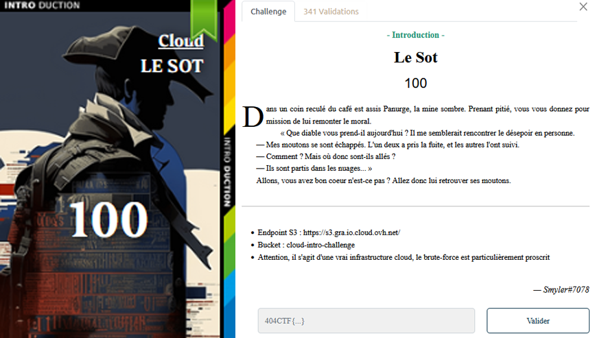

# Cloud - Le sot

## Challenge description

## Resolution

On se connecte avec `https://cloud-intro-challenge.s3.gra.io.cloud.ovh.net/`.

Si on ouvre avec Firefox ; on voit une page vide, avec le texte :  `cloud-intro-challenge1000falseles-moutons.json2023-05-12T13:56:48.000Z"d642390a5d6f695d958015801e585cb1"1767STANDARD`. 

Avec d'autres navigateurs : 

On voit qu'il y a un fichier `les-moutons.json`.

On peut tenter d'y accéder avec : `https://cloud-intro-challenge.s3.gra.io.cloud.ovh.net/les-moutons.json`.

On voit un `.json` avec plein de moutons, et le flag à la fin.

Le flag : `404CTF{D35_m0utOns_D4n5_13s_NU@g3s}`.
