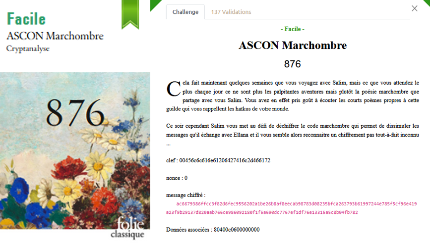

# Crypto - ASCON Marchombre

## Challenge description



## Resolution

En cherchant sur internet, on trouve :

> Ascon is a family of lightweight authenticated ciphers that had been selected by US National Institute of Standards and Technology (NIST) for future standardization of the lightweight cryptography.

On trouve aussi une librairie Python, donc on peut faire un script pour déchiffrer le message. Etant donné que j'ai eu des soucis avec la librairie, je l'ai copié dans un fichier `ascon2.py`. Les deux scripts sont dans le dossier `./src/ASCON_marchombre`.

<details>
<summary> Le script Python </summary>

```python
import ascon2

my_key = bytes.fromhex('00456c6c616e61206427416c2d466172') # Ellana d'Al-Far <333
my_nonce = bytes.fromhex('00000000000000000000000000000000')
secret_message = bytes.fromhex('ac6679386ffcc3f82d6fec9556202a1be26b8af8eecab98783d08235bfca263793b61997244e785f5cf96e419a23f9b29137d820aab766ce986092180f1f5a690dc7767ef1df76e13315a5c8b04fb782')
associated_data = bytes.fromhex('80400c0600000000')

# Decipher the ASCON message
# CODE HERE
print(type(my_key), type(my_nonce), type(secret_message), type(associated_data))
print(len(my_key), len(my_nonce), len(secret_message), len(associated_data))
text = ascon2.ascon_decrypt(my_key, my_nonce, associated_data, secret_message)
print(text)

# 404CTF{V3r5_l4_lum1\xe8r3.} -> 404CTF{V3r5_l4_lum1èr3.}
```

</details><br>

Le flag est donc `404CTF{V3r5_l4_lum1èr3.}`, à la fin d'un super poème Marchombre.