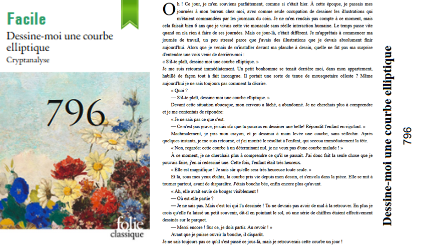

# Crypto - Dessine moi une courbe elliptique

## Challenge description



## Resolution

On a a notre disposition un fichier `challenge.py` et un fichier `data.txt` qui contient le resultat de ce texte. Le code utilise la librairie sage, et on peut ré-utiliser cette librairie pour décoder le flag. 

J'ai utilisé ce compilateur en ligne : [Cocalc.com](https://cocalc.com/)

<details>
<summary> Le script Python</summary>

```python
from Crypto.Cipher import AES
import hashlib

x1 = 93808707311515764328749048019429156823177018815962831703088729905542530725
x2 = 139273587750511132949199077353388298279458715287916158719683257616077625421
y1 = 144188081159786866301184058966215079553216226588404139826447829786378964579
y2 = 30737261732951428402751520492138972590770609126561688808936331585804316784

p = 231933770389389338159753408142515592951889415487365399671635245679612352781

F = GF(p) #C'est mieux parce que sinon ça marche po

x1 = F(x1)
x2 = F(x2)
y1 = F(y1)
y2 = F(y2)

x1moins2 = x1 - x2
z = (x1moins2)**(-1)


# Trouvons a
a = ((y1^2) - (y2^2) - (x1^3) + (x2^3))*z
print(a)

b = (y1^2) - (x1^3) - (a*x1)

print("\n", b, "\n")

E = EllipticCurve(GF(p), [a,b])
G = E(x1,y1)
H = E(x2,y2)

determinant = 4 * a**3 + 27 * b**2
assert determinant != 0


#print(G.xy()[0], G.xy()[1])
#print(H.xy()[0], H.xy()[1])
#print(p)

iv_hex = "00b7822a196b00795078b69fcd91280d"
iv = bytes.fromhex(iv_hex)
key = str(a) + str(b)
aes = AES.new(hashlib.sha1(key.encode()).digest()[:16], AES.MODE_CBC, iv=iv)
cipher = bytes.fromhex("8233d04a29befd2efb932b4dbac8d41869e13ecba7e5f13d48128ddd74ea0c7085b4ff402326870313e2f1dfbc9de3f96225ffbe58a87e687665b7d45a41ac22")
flag = aes.decrypt(cipher)
print(flag)
```

</details><br>

Le flag est donc `404CTF{70u735_l35_gr4nd35_p3r50nn3s_0nt_d_@b0rd_373_d35_3nf4n7s}`.