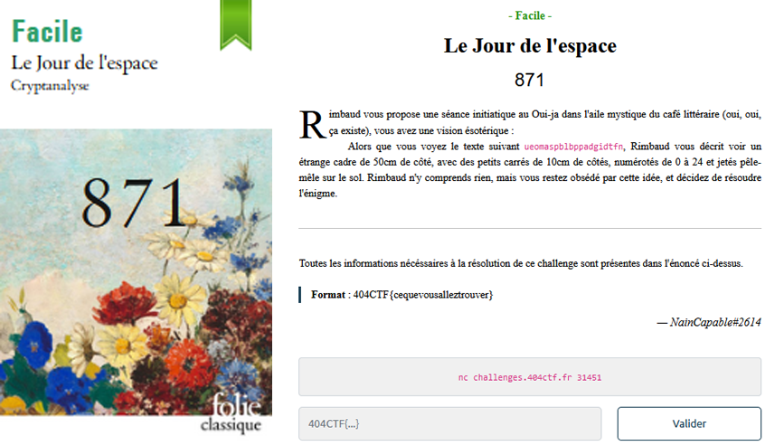
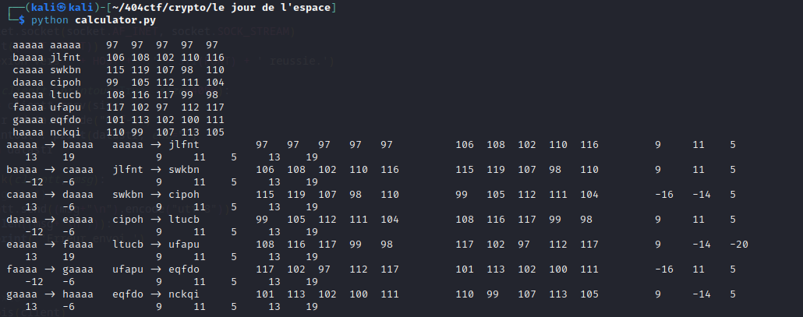

# Crypto - Le jour de l'espace

## Challenge description



## Resolution

On peut se connecter en nc, et envoyer un message qui sera renvoyé chiffré. On peut tester plusieurs choses, et on se rend compte que :

- De 1 à 5 caractères, on nous renvoie toujours 5 caractères
- Ce n'est pas chiffré lettre à lettre
- On peut donc supposer que c'est chiffré par bloc de 5 caractères, et recupérer quelques blocs pour essayer de trouver la méthode de chiffrement

J'ai commencé par récupérer les messages chiffrés pour les messages 'aaaaa', 'aaaab', 'aaaac' ...

Ensuite, j'ai tenté de comparer ces messages pour voir si je pouvais trouver quelques chose. J'arrive assez rapidement a me rendre compte que la dernière lettre change de façon cyclique.

On se rend compte qu'il est question de modulo 26 : on chiffre en ajoutant la valeur à chaque lettre. En tentant de déchiffrer, on voit aussi que selon la lettre changée, on a des modulos différents. 

<details>
<summary> Le script utilisé pour calculer les modulos et faire les tests </summary>

```python

"""correspondances = {'aaaaa': 'aaaaa', 'aaaab': 'idmry', 'aaaac': 'qgyjx', 'aaaad': 'yjlbw', 'aaaae': 'hmxsv',
                   'aaaaf': 'ppkku', 'aaaag': 'xswct', 'aaaah': 'gvjts', 'aaaai': 'oyvlr', 'aaaaj': 'wcidq',
                   'aaaak': 'ffuup', 'aaaal': 'nihmo', 'aaaam': 'vlten', 'aaaan': 'eogvm', 'aaaao': 'mrsnl',
                   'aaaap': 'uuffk', 'aaaaq': 'dxrwj', 'aaaar': 'lbeoi', 'aaaas': 'teqgh', 'aaaat': 'chdxg',
                   'aaaau': 'kkppf', 'aaaav': 'snche', 'aaaaw': 'bqoyd', 'aaaax': 'jtbqc', 'aaaay': 'rwnib'}"""


"""correspondances = {'aaaaa' : 'aaaaa','aaaba' : 'ubkqx','aaaca' : 'pcuhv','aaada' : 'kdfxt','aaaea' : 'fepor','aaafa' : 'afafp','aaaga' : 'ugkvn','aaaha' : 'phuml'}"""

#correspondances = {'aaaaa': 'aaaaa','aabaa': 'schpw','aacaa': 'leoft','aadaa': 'egvuq','aaeaa': 'widkn','aafaa': 'pkkak','aagaa': 'imrph','aahaa': 'boyfe'}

# correspondances = {'aaaaa': 'aaaaa','abaaa': 'eagov','acaaa': 'iamdr','adaaa': 'masrn','aeaaa': 'qaygj','afaaa': 'uafuf','agaaa': 'yaljb','ahaaa': 'darxw'}
correspondances = {'aaaaa': 'aaaaa','baaaa': 'jlfnt','caaaa': 'swkbn','daaaa': 'cipoh','eaaaa': 'ltucb','faaaa': 'ufapu','gaaaa': 'eqfdo','haaaa': 'nckqi'}
# Dans correspondances, afficher chaque couple
for i in correspondances.keys():
    print("\n", i, correspondances[i], end="\t")
    # Affiche le code ascii de chaque lettre
    for j in correspondances[i]:
        txt = str(ord(j))
        if len(str(txt)) < 3 :
            txt = txt + " "
        print(txt, end=" ")
print("")

keyslsit = list(correspondances.keys())
for i in range(len(keyslsit)-1):
    print(keyslsit[i], "->", keyslsit[i+1], " ", correspondances[keyslsit[i]], "->", correspondances[keyslsit[i+1]], end="\t\t")
    # Affiche le code ascii de chaque lettre
    firstc = correspondances[keyslsit[i]]
    secondc = correspondances[keyslsit[i+1]]
    assert(len(firstc) == len(secondc))
    diff_ord = (ord(l)-ord(k) for k,l in zip(firstc, secondc))
    diff_ord2 = ((ord(l)-ord(k))%25 for k,l in zip(firstc, secondc))
    a = "  ".join([str(ord(i)) if len(str(ord(i)))==3 else str(ord(i))+" " for i in firstc])
    b = "  ".join([str(ord(i)) if len(str(ord(i)))==3 else str(ord(i))+" "for i in secondc])
    c = "  ".join([str(i) if len(str(i))==4 else str(i)+(" "*(4-len(str(i)))) for i  in diff_ord])
    d = "  ".join([str(i) if len(str(i))==4 else str(i)+(" "*(4-len(str(i)))) for i  in diff_ord2])
    print(a, b, c, d, sep="\t\t")
# La dernière lettre semble être son inverse dans l'alphabet : b->y, y->b

```

</details><br>

Ce qui donne des resultats comme :



On peut trouver tout les modulos pour un changement de la première lettre, la deuxième, ... jusqu'à la cinquième. 

On trouve les modulos suivant : 

| Lettre modifiée | Modulo lettre 1 | Modulo lettre 2 | Modulo lettre 3 | Modulo lettre 4 | Modulo lettre 5 |
|:---------------:|:---------------:|:---------------:|:---------------:|:---------------:|:---------------:|
| 1 | 9 |  11 |  5 |  13  |  19 |
| 2 |  4 | 0 | 6 | 14 | 21 | 
| 3 | 18 | 2 | 7 | 15 | 22 |
|4 | 20 | 1 | 10 | 16 | 23 |
| 5 | 8 |  3 |  12 |  17 | 24 | 

Cela signifie que si on passe de 'aaaaa' à 'aaaab', on ajoute 9 à la première lettre, 11 à la deuxième, 5 à la troisième, 13 à la quatrième et 19 à la cinquième. 

On a donc un chiffrement qui dépend du chiffrement d'avant, et pour le décoder, j'ai tout simplement décodé toutes les possibilités jusqu'à la bonne (même s'il y avait peut-être une méthode plus rapide).

On cherche donc les chiffrement qui donneront les mots "ueoma", "spblb", "ppadg" et "idtfn".

<details>
<summary> Le script pour déchiffrer </summary>

```python

def cipher(oldciphertext, modulokey):
    encrypted = ''
    for j in range(5):
        letter = chr(ord(oldciphertext[j]) + modulokey[j])
        # If the letter ord > ord('y'), we have to go back to 'a'
        if ord(letter) > ord('y'):
            letter = chr(ord(letter) - 25)
        encrypted += letter
    return encrypted


def increment_letter(baseword, indexletter):
    last_letter = (ord(baseword[indexletter])+1 - ord('a'))%25 + ord('a')
    newword = baseword[:indexletter]  + chr(last_letter) + baseword[indexletter+1:]
    return newword

# on sait que les lettres utilisées sont : abcdefghijklmnopqrstuvwxy 
# on sait que le modulo de l'ascii de pour chaque lettre du cipher; le modulo a 25 vaut : 8 3 12 17 24
# Donc on peut retrouver la fonction d'encodage : on part de aaaaa on ajoute le modulo correspondant à chaque lettre
last_plain_text = 'aaaaa'
last_encrypted_text = 'aaaaa'


modulo = {1:[9, 11, 5, 13, 19],2:[4,0,6,14,21],3:[18,2,7,15,22],4:[20,1,10,16,23],5:[8, 3, 12, 17, 24]}
encryption = {}

# For each combination between 'aaaaa' and 'yyyyy', we compute the encryption
# We have to increment one by one the last letter, then the one before, etc.
goals = ["ueoma", "spblb", "ppadg", "idtfn"]
nb_goals_found = 0
## Last letter
for let1 in range(25):
    save_plain_text1 = last_plain_text # aaaaa -> aaaaa
    save_encry_text1 = last_encrypted_text # aaaaa -> aaaaa
    print(last_plain_text)
    for let2 in range(25):
        save_plain_text2 = last_plain_text # aaaaa -> aaaaa
        save_encry_text2 = last_encrypted_text # aaaaa -> aaaaa

        for let3 in range(25):
            save_plain_text3 = last_plain_text # aaaaa -> aaaaa
            save_encry_text3 = last_encrypted_text # aaaaa -> aaaaa

            for let4 in range(25):
                save_plain_text4 = last_plain_text # aaaaa -> aaaaa
                save_encry_text4 = last_encrypted_text # aaaaa -> aaaaa

                for let5 in range(25):
                    #print(last_plain_text, last_encrypted_text)
                    encryption[last_plain_text] = last_encrypted_text

                    last_encrypted_text = cipher(last_encrypted_text, modulo[5])
                    last_plain_text = increment_letter(last_plain_text, 4)
                    
                    if last_encrypted_text in goals:
                        nb_goals_found += 1
                        print("FOUND: ", last_plain_text, last_encrypted_text)
                        with open('results.txt', 'a') as f:
                            f.write(last_plain_text + ' : ' + last_encrypted_text + '\n')
                        if nb_goals_found == 4:
                            exit(0)


                #print(last_plain_text, last_encrypted_text)
                encryption[last_plain_text] = last_encrypted_text

                last_plain_text = save_plain_text4
                last_encrypted_text = save_encry_text4

                last_encrypted_text = cipher(last_encrypted_text, modulo[4])
                last_plain_text = increment_letter(last_plain_text, 3)

            #print(last_plain_text, last_encrypted_text)
            encryption[last_plain_text] = last_encrypted_text

            last_plain_text = save_plain_text3
            last_encrypted_text = save_encry_text3
            
            last_encrypted_text = cipher(last_encrypted_text, modulo[3])
            last_plain_text = increment_letter(last_plain_text, 2)

        #print(last_plain_text, last_encrypted_text)
        encryption[last_plain_text] = last_encrypted_text

        last_plain_text = save_plain_text2
        last_encrypted_text = save_encry_text2
        
        last_encrypted_text = cipher(last_encrypted_text, modulo[2])
        last_plain_text = increment_letter(last_plain_text, 1)
    
    #print(last_plain_text, last_encrypted_text)
    encryption[last_plain_text] = last_encrypted_text

    last_plain_text = save_plain_text1
    last_encrypted_text = save_encry_text1
    
    last_encrypted_text = cipher(last_encrypted_text, modulo[1])
    last_plain_text = increment_letter(last_plain_text, 0)

                


        


with open('deciphered.txt', 'a') as f:
    for key in encryption.keys():
        f.write(key + ' : ' + encryption[key] + '\n')
```
</details><br>

On obtient : 

    FOUND:  assas ppadg
    FOUND:  barja ueoma
    FOUND:  sinea idtfn
    FOUND:  velma spblb

On obtient `assas barja sinea velma`. Il faut bien se rappeler que comme on encode par 5 caractères, on a un padding et les espaces ne sont pas au bon endroit. Il faut aussi remettre les 4 mots dans l'ordre. 

Dans l'odre, `barja velma assas sinea`, et si on lit a voit haute on obtient `barjavelmaassassine` (le `a` est du padding). 

Le flag est donc `404CTF{barjavelmaassassine}`.

