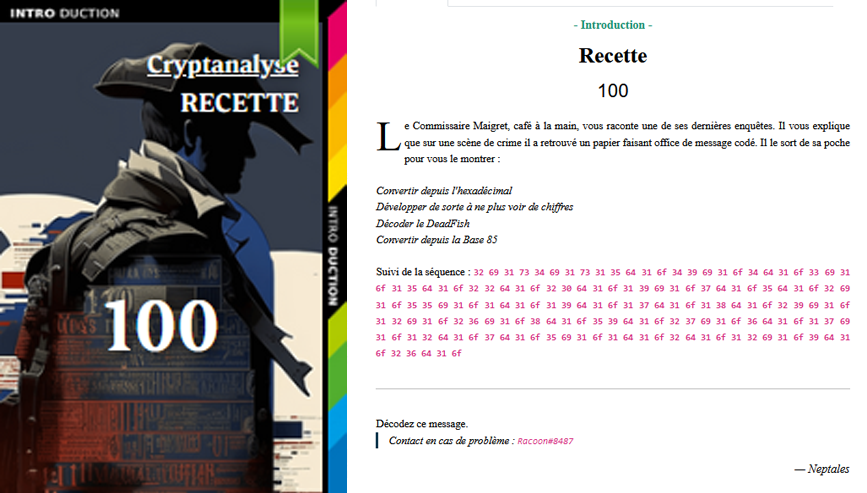

# Crypto - Recette

## Challenge description



## Resolution

On a cette séquence :

```
32 69 31 73 34 69 31 73 31 35 64 31 6f 34 39 69 31 6f 34 64 31 6f 33 69 31 6f 31 35 64 31 6f 32 32 64 31 6f 32 30 64 31 6f 31 39 69 31 6f 37 64 31 6f 35 64 31 6f 32 69 31 6f 35 35 69 31 6f 31 64 31 6f 31 39 64 31 6f 31 37 64 31 6f 31 38 64 31 6f 32 39 69 31 6f 31 32 69 31 6f 32 36 69 31 6f 38 64 31 6f 35 39 64 31 6f 32 37 69 31 6f 36 64 31 6f 31 37 69 31 6f 31 32 64 31 6f 37 64 31 6f 35 69 31 6f 31 64 31 6f 32 64 31 6f 31 32 69 31 6f 39 64 31 6f 32 36 64 31 6f
```

Depuis [CyberChef](https://cyberchef.org/) on traduit `from Hex` et on obtient :

```
2i1s4i1s15d1o49i1o4d1o3i1o15d1o22d1o20d1o19i1o7d1o5d1o2i1o55i1o1d1o19d1o17d1o18d1o29i1o12i1o26i1o8d1o59d1o27i1o6d1o17i1o12d1o7d1o5i1o1d1o2d1o12i1o9d1o26d1o
```

Ensuite, il faut developper, donc `4s` → `ssss` etc (comme on le ferait en maths). On peut utiliser le script dans `./src/recette/develop.py`. 

On obtient :

```
iisiiiisdddddddddddddddoiiiiiiiiiiiiiiiiiiiiiiiiiiiiiiiiiiiiiiiiiiiiiiiiioddddoiiiodddddddddddddddoddddddddddddddddddddddoddddddddddddddddddddoiiiiiiiiiiiiiiiiiiiodddddddodddddoiioiiiiiiiiiiiiiiiiiiiiiiiiiiiiiiiiiiiiiiiiiiiiiiiiiiiiiiiododddddddddddddddddddodddddddddddddddddoddddddddddddddddddoiiiiiiiiiiiiiiiiiiiiiiiiiiiiioiiiiiiiiiiiioiiiiiiiiiiiiiiiiiiiiiiiiiioddddddddodddddddddddddddddddddddddddddddddddddddddddddddddddddddddddoiiiiiiiiiiiiiiiiiiiiiiiiiiioddddddoiiiiiiiiiiiiiiiiioddddddddddddodddddddoiiiiiododdoiiiiiiiiiiiiodddddddddoddddddddddddddddddddddddddo
```

Depuis le site [Dcode](https://www.dcode.fr/deadfish-language); on décode le deadfish et on obtient :

```
1b^aR<(;4/1hgTC1NZtl1LFWKDIHFRI/
``` 

A nouveau depuis [CyberChef](https://cyberchef.org/), on traduit depuis la Base85 :

`404CTF{M4igr3t_D3_c4naRd}`