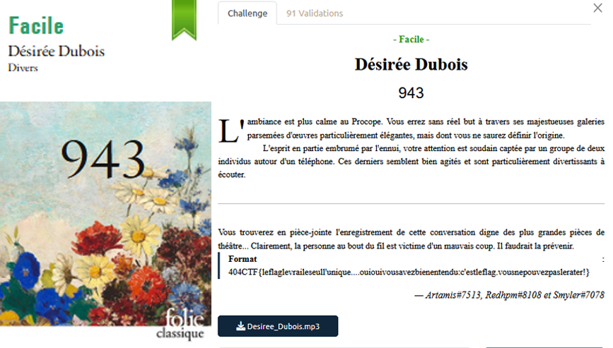
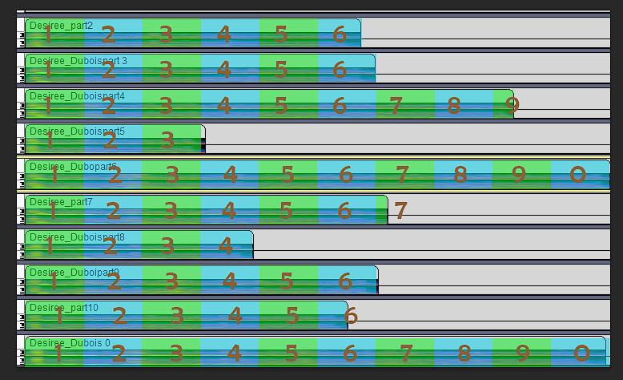
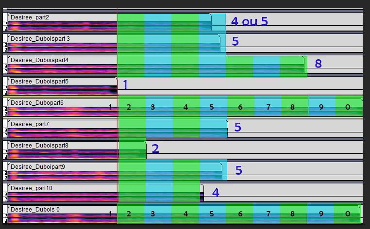

# Divers - Désirée Dubois

## Challenge description

## Resolution

On a un magnifique audio, parodie d'une scène bien connue. 

J'ai pensé a plusieurs pistes pour ce challenge : 

- Recopier en entier le script dans le flag, mais ça n'a pas trop d'intérêt
- Utiliser le numéro de téléphone comme flag; pour ça il faut le retrouver

Avec audacity, et photoshop, j'ai tenté de retrouver le numéro.

Au début, j'ai pris la longueur totale du retour, mais les numéros de téléphone ne correpondaient pas :

- Comme donnée de base, on sait que le premier son est un 0, et ce sera le plus long retour. On voit un autre retour du quasi même temps, donc c'est surement un 0 aussi.
- Au début j'avais donc divisé par 10 la longueur totale du retour sur les 0 et compté le nombre de fois ou ça rentrait sur les autres cases, mais j'avais que des chiffres très hauts :

En ré-écoutant la piste, je me suis rendue compte que le 5ème numéro était très court, et ça me paraissait compliqué d'avoir un temps de retour plus court : j'ai supposé que c'était un 1.

J'ai donc refait le même procédé, en partant du 1 comme base et sans compter le début du retour. C'est a dire, j'ai compté que le temps du 1 était le temps minimum, et celui du 0 maximum. J'ai donc divisé le delta de temps entre un 0 et un 1 par 9, et j'ai obtenu :

On a 2 numéros possibles : 04 58 10 52 54 et 05 58 10 52 54. Quand on appelle le premier, on entend quelqu'un raler et dire "entrez juste le flag". Ca a apparemment posé des problème a beaucoup de gens, mais je dois vraiment avoir un humour nul parce que j'ai tout de suite compris, et j'ai donc formatté en minuscule, avec le format habituel.

Le flag est donc `404CTF{justeleflag}`. 