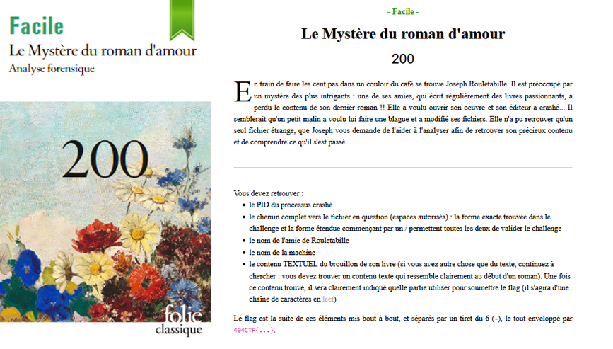
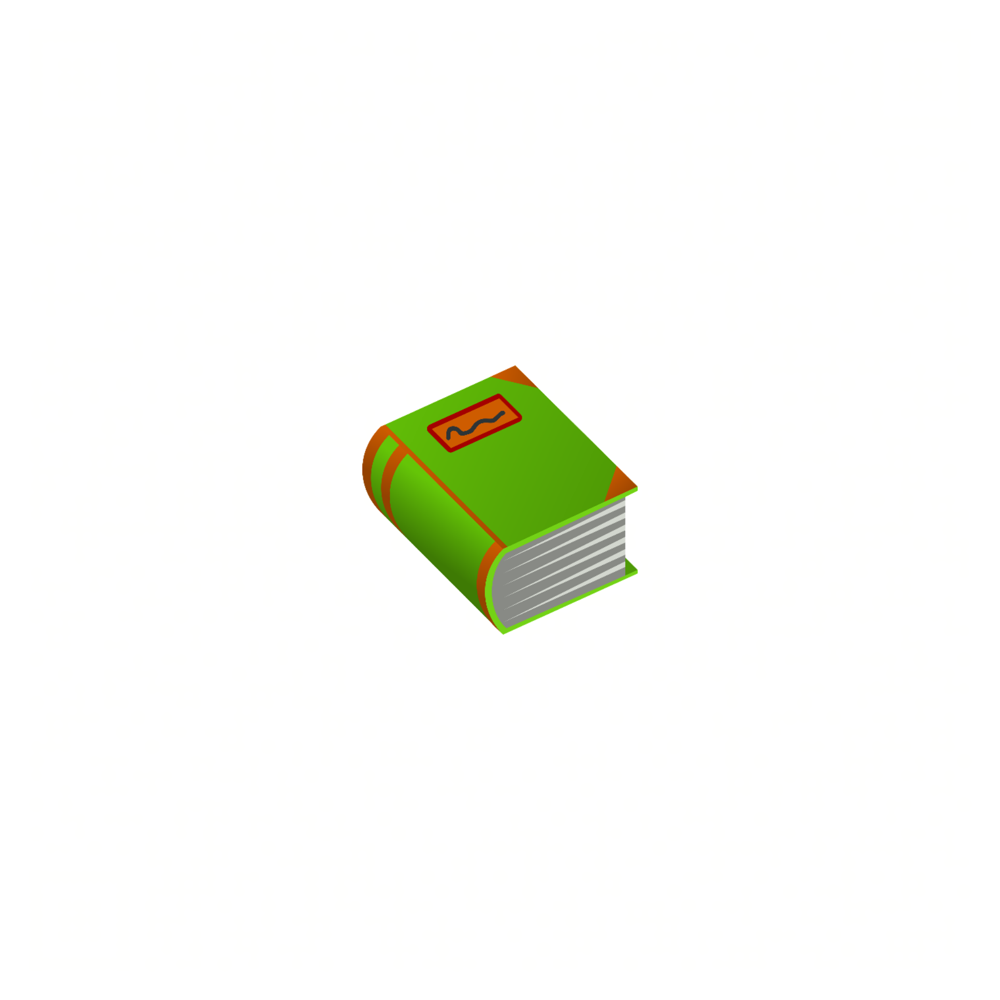
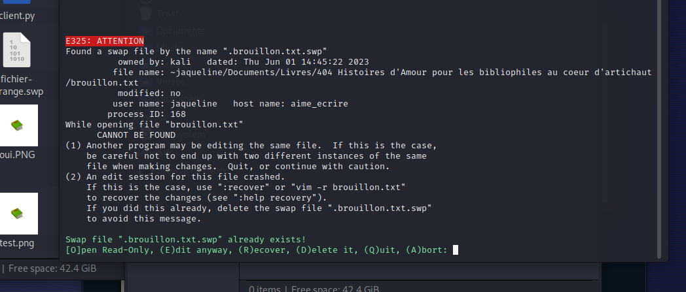

# Forensics - Le mystère du roman d'amour

## Challenge description



## Resolution

C'est un fichier `.swp` qui est un fichier de sauvegarde de *Vim*.

On va donc l'ouvrir plusieurs fois : directement, et avec le mode de récupération de *Vim* (`vim -r fichier-etrange.swp`).


On récupère alors le nom du fichier, et son chemin : `jaqueline/Documents/Livres/404 Histoires d'Amour pour les bibliophiles au coeur d'artichaut/brouillon.txt`.

En regardant le début du fichier, on voit que c'est un `PNG`. On enregistre sous `brouillon.png` et on ouvre l'image obtenue.



Ensuite, il faut passer cette image dans un LSB (soit par un script, soit sur Aperi'Solve):


Ce QR code donne un texte :

```
Il était une fois, dans un village rempli d'amour, deux amoureux qui s'aimaient...

Bien joué ! Notre écrivaine va pouvoir reprendre son chef-d'oeuvre grâce à vous !
Voici ce que vous devez rentrer dans la partie "contenu du fichier" du flag : 3n_V01L4_Un_Dr0l3_D3_R0m4N
```

Pour le pid, il faut provoquer la recovery : j'ai renommé le fichier en .brouillon.txt.swp et j'ai `vim brouillon.txt` : j'ai eu cet écran avec le pid :



`404CTF{168-~jaqueline/Documents/Livres/404 Histoires d'Amour pour les bibliophiles au coeur d'artichaut/brouillon.txt-jaqueline-aime_ecrire-3n_V01L4_Un_Dr0l3_D3_R0m4N}`