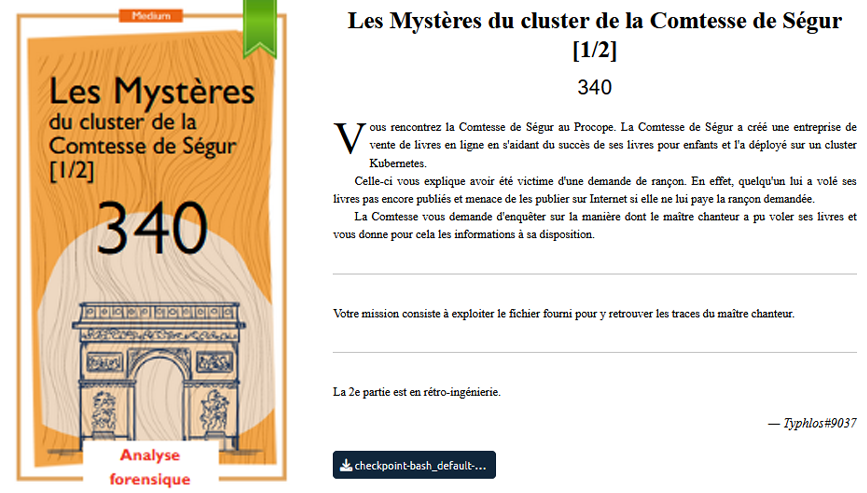

# Forensics - Les mystères du cluster de la Comtesse de Ségur

## Challenge description

## Resolution

On farfouille les fichiers, parce que c'est la fin du CTF donc bon on a plus rien a perdre, et donc vive le ctrl+f.

dans `io.kubernetes.cri-o.LogPath` à la fin on voir un flag.txt, on remonte un peu, on voit que le fichier vient d'un agent.zip.

Un peut plus haut, on trouve le lien d'un curl : [agent.challenges.404ctf.fr](agent.challenges.404ctf.fr). C'est un CTF, donc on peut cliquer et cela télécharge le fichier `agent.zip`.

Dans le `flag.txt`, on trouve le flag : `404CTF{K8S_checkpoints_utile_pour_le_forensic}`.