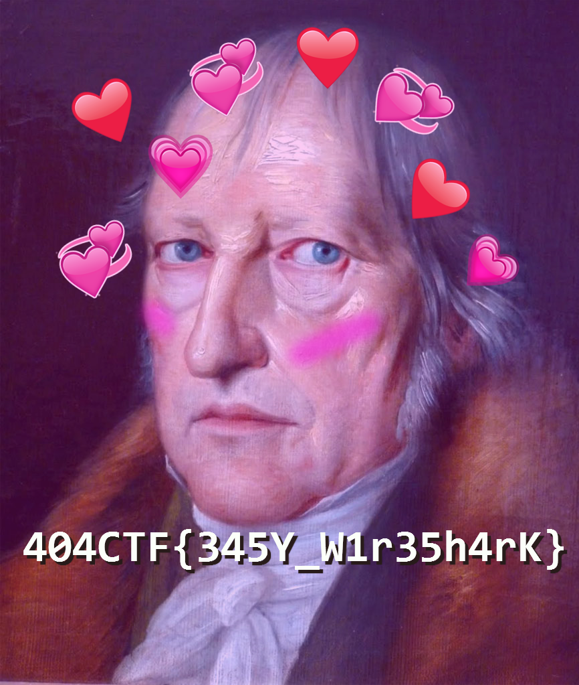

# Forensics - Pêche aux livres

## Challenge description

## Resolution

On ouvre le fichier `peche_au_livre.pcapng` avec *Wireshark*.

On regarde un peu les paquets, et on voit des paquets *HTTP* qui contiennent des images.

On extrait ces images avec *File > Export Objects > HTTP*.

On sauvegarde ces images, et l'image "hegel-sensei-uwu.png" contient le flag.

  

Flag : `404CTF{345Y_W1r35h4rK}`