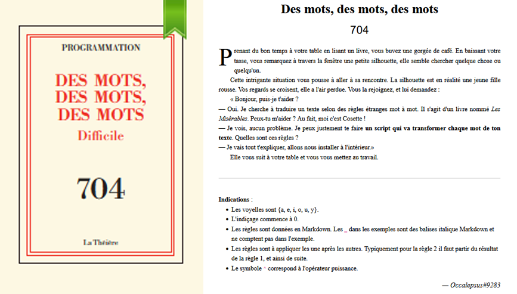

# Programmation - Des mots, des mots, des mots

## Challenge description



## Resolution

On se connecte et on voit qu'on va avoir des traductions avec différentes règles. J'ai donc fait un script python avec une fonction pour chaque règle, qui se connecte au serveur et qui renvoie la traduction.


<details>
<summary>Le script python</summary>

```python

def regle1(mot):
    """Règle 1 : Inverser les lettres"""
    return "".join([mot[len(mot)-i-1] for i in range(len(mot))])

def regle2(mot):
    """Règle 2 :
    - Si le mot à un nombre de lettres pair, échanger la 1ere et la 2e partie du mot obtenu
    - Sinon, enlever toutes les lettres du mot correspondant à la lettre centrale"""
    if (len(mot))%2==0:
        return mot[len(mot)//2:]+mot[:len(mot)//2]
    else:
        midle = len(mot)//2
        let = mot[midle]
        #return the word without all the letter "let"
        return mot.replace(let,"")

def regle3(mota):
    """Si le mot a 3 lettres ou plus_ :
    - Si la 3e lettre du mot obtenu par 1 et 2 est une consonne, "décaler" les voyelles vers la gauche dans le mot original, puis réappliquer les règles 1 et 2.
    - Sinon : la même chose mais les décaler vers la droite."""
    obtenu = regle2(regle1(mota))
    obtenulist = list(obtenu)
    if len(obtenu) >= 3 :
        mot = list(mota)
        consandunder = []
        for i in mot :
            if i not in "aeiouy" :
                consandunder.append(i)
            else :
                consandunder.append("_")
        voyelles = [mot[i] for i in range(len(mot)) if mot[i] in "aeiouy"]
        if obtenulist[2] in "aeiouy" :
            voyelles = [voyelles[-1]] + voyelles[:-1]
        else :
            voyelles = voyelles[1:] + [voyelles[0]]
        word = []
        for i in consandunder :
            if i == "_" :
                word.append(voyelles.pop(0))
            else :
                word.append(i)
        word = "".join(word)
        return regle2(regle1(word))
    else :
        return obtenu

def regle4(mota):
    """Pour `n` allant de 0 à la fin du mot OK
    si le caractère `c` à la position `n` du mot est une consonne (majuscule ou minuscule): OK
    insérer en position `n+1` le caractère de code ASCII `a = ((vp + s) % 95) + 32`
    où `vp` est le code ASCII de la voyelle précédant la consonne `c` dans l'alphabet (si `c = 'F'`, `vp = 'E'`),
    et `s = SOMME{i=n-1 -> 0}(a{i}*2^(n-i)*Id(l{i} est une voyelle))`, 
    où `a{i}` est le code ASCII de la `i`-ième lettre du mot, `Id(x)` vaut `1` si `x` est vrai,
    `0` sinon, et `l{i}` la `i`-ième lettre du mot. 
    _Attention à bien appliquer cette règle aussi sur les caractères insérés au mot. -> While loop"""
    n = 0
    mot = list(mota)
    #alphabet = "abcdefghijklmnopqrstuvwxyzABCDEFGHIJKLMNOPQRSTUVWXYZ"
    while n < len(mot):
        if mot[n] in "bcdfghjklmnpqrstvwxzBCDFGHJKLMNPQRSTVWXZ":
            # Recuperation de la voyelle precedente
            vp = ord(voyelleprecedente_alphabet(mot[n]))
            # Calcul de s : s = SOMME{i=n-1 -> 0}(a{i}*2^(n-i)*Id(l{i} est une voyelle))
            s = 0
            for i in range(n-1, -1, -1):
                # Calculons a{i}*2^(n-i)*Id(l{i} est une voyelle
                a_i = ord(mot[i])
                if mot[i] in "aeiouyAEIOUY": #le Id
                    s += (a_i)*(2**(n-i))
            # Calcul de a = ((vp + s) % 95) + 32
            a = ((vp + s) % 95) + 32
            # Insertion de a en position n+1
            mot.insert(n+1, chr(a))
        n += 1
    print("".join(mot))
    return tri_ordre_croissant("".join(mot))


def voyelleprecedente_alphabet(n):
    ascii_voyelles_ord = [ord(i) for i in "AEIOUYaeiouy~"]
    ascii_voyelles = [i for i in "AEIOUYaeiouy~"]
    # trouver la voyelle precedente
    for i in range(len(ascii_voyelles_ord)):
        if (ascii_voyelles_ord[i] < ord(n)) and (ascii_voyelles_ord[min(i+1, len(ascii_voyelles_ord))] > ord(n)):
            return ascii_voyelles[i]

def tri_ordre_croissant(mot):
    nb_occ = dict()
    for i in mot:
        if i not in nb_occ.keys():
            nb_occ[i] = 1
        else:
            nb_occ[i] += 1

    # trier les lettres par ordre croissant
    numbers = dict()
    for k, v in nb_occ.items():
        if v not in numbers.keys():
            numbers[v] = [k]
        else:
            numbers[v].append(k)
    
    word = []
    for i in sorted(numbers.keys(), reverse=True):
        # trier les lettres par ordre code ascii croissant
        numbers[i].sort()
        for j in numbers[i]:
            word.append(j*i)
    return "".join(word)
        
            

assert(regle1("hello")=="olleh")
assert(regle2("hello")=="heo")
assert(regle2("bato")=="toba")
assert(regle3("poteau") == regle2(regle1("petauo")))
assert(regle3("drapeau")== regle2(regle1("drupaea")))
for i in range(6):
    a = ["c","f","z", "C", "F", "Z"]
    b = ["a", "e", "y", "A", "E", "Y"]
    assert(voyelleprecedente_alphabet(a[i])==b[i])
assert(tri_ordre_croissant("patate")=="aattep")

#mymot = "cosette"
#print("Word:", mymot, "\n", "R1", regle1(mymot),"\n","R2", regle2(regle1(mymot)), "\n","R3", regle3("cosette"), "\n","R3",regle4(regle3("cosette")))

def translate(mot):
    return regle4(regle3(mot))

#################################COMMUNICATION#################################
import socket
import time
import string

HOST = 'challenges.404ctf.fr'
PORT = 30980

client = socket.socket(socket.AF_INET, socket.SOCK_STREAM)
client.connect((HOST, PORT))
print( 'Connexion vers ' + HOST + ':' + str(PORT) + ' reussie.')

def recv_bis(clientt, printout=True, size=4096):
       data = clientt.recv(size)
       datastr =data.decode("utf-8")
       if printout : print(datastr, end="")
       return datastr

def send_check(clientt, msg):
    #print(msg+"\n")
    n = clientt.send((msg+"\n").encode("utf-8"))
    if (n != len((msg+"\n"))):
            print( 'Erreur envoi.')

time.sleep(3)
recv_bis(client)
send_check(client, "cosette")
time.sleep(0.3)
recv_bis(client)
send_check(client, regle1("cosette"))
time.sleep(0.3)
recv_bis(client)
send_check(client, regle2(regle1("cosette")))
time.sleep(0.3)
recv_bis(client)
send_check(client, regle3("cosette"))
time.sleep(0.3)
recv_bis(client)
send_check(client, translate("cosette"))
texte = recv_bis(client)
texte = texte.split("{")[-1].split("}")[0].split(" ")
translated = []
for mot_a_traduire in texte :
    translated.append(translate(mot_a_traduire))
send_check(client, " ".join(translated))
print("~~~~~~".join(translated))
time.sleep(0.3)
recv_bis(client)
```

</details>

On obtient alors le flag : `404CTF{:T]cdeikm_)W_doprsu_nt_;adei}`.