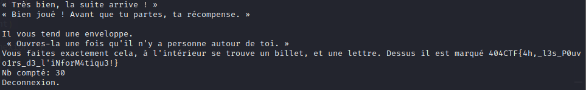

# Programmation - L'innondation

## Challenge description


## Resolution

On se connecte avec `nc`, et on voit qu'on doit compter les rhinos. On peut le faire avec un `grep`, mais j'aime me compliquer la vie donc j'ai fais un script en python.

```python

# nc challenges.france-cybersecurity-challenge.fr 2350

import socket
import time
import string

HOST = 'challenges.404ctf.fr'
PORT = 31420

client = socket.socket(socket.AF_INET, socket.SOCK_STREAM)
client.connect((HOST, PORT))
print( 'Connexion vers ' + HOST + ':' + str(PORT) + ' reussie.')

def recv_bis(clientt, printout=True, size=4096):
       data = clientt.recv(size)
       datastr =data.decode("utf-8")
       if printout : print(datastr, end="")
       return datastr

def send_check(clientt, msg):
    #print(msg+"\n")
    n = clientt.send((msg+"\n").encode("utf-8"))
    if (n != len((msg+"\n"))):
            print( 'Erreur envoi.')

time.sleep(3)

######### Premiere vague
test = recv_bis(client)

txt = test.split("\n")
troupeau = txt[2:-3]
#print("| Comp txt de base et filtré troupeaux | de base :", len(txt), "troupeau", len(troupeau))
#assert(len(txt)==len(troupeau)+5)

cpt_rhino = 0
rhinos = ""
for i in troupeau :
    rhinos += i


rhinos = rhinos.split(' ')
rhinos = [s for s in rhinos if s != '']

# envoyer len(rhinos)
for i in rhinos :
    if len(i)!=6 :
        cpt_rhino += 1
print("Nb compté:", len(rhinos)+cpt_rhino)
send_check(client, str(len(rhinos)+cpt_rhino))
time.sleep(0.3)

# Seconde vague
for i in range(100):
    test = recv_bis(client)

    txt = test.split("\n")
    troupeau = txt[1:-3]
    #print("| Comp txt de base et filtré troupeaux | de base :", len(txt), "troupeau", len(troupeau))
    #assert(len(txt)==len(troupeau)+5)

    cpt_rhino = 0
    rhinos = ""
    for i in troupeau :
        rhinos += i


    rhinos = rhinos.split(' ')
    rhinos = [s for s in rhinos if s != '']

    # envoyer len(rhinos)
    for i in rhinos :
        if len(i)!=6 :
            cpt_rhino += 1
    print("Nb compté:", len(rhinos)+cpt_rhino)
    send_check(client, str(len(rhinos)+cpt_rhino))
    time.sleep(0.3)

recv_bis(client)

print( 'Deconnexion.')
client.close()
```



On trouve le flag : `404CTF{4h,_l3s_P0uvo1rs_d3_l'iNforM4tiqu3!}`.