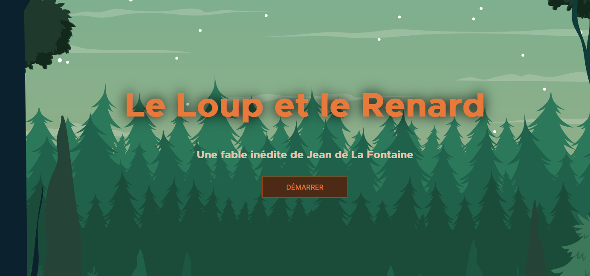
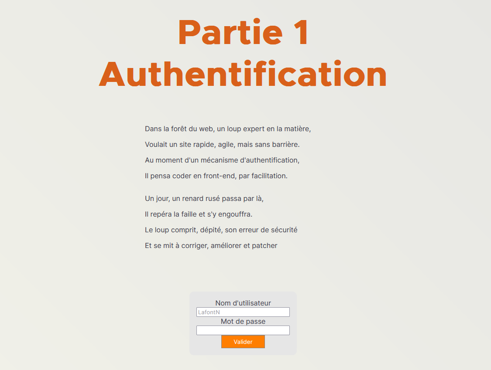
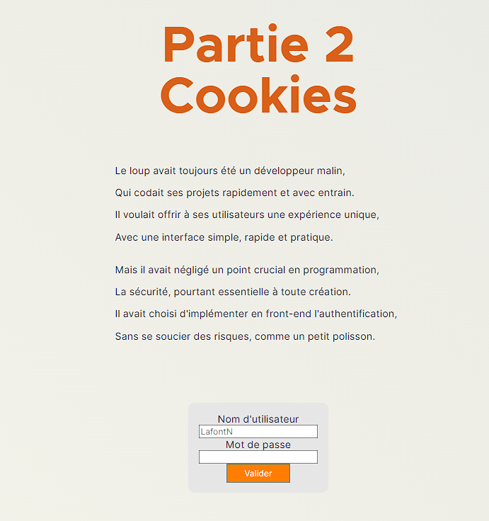
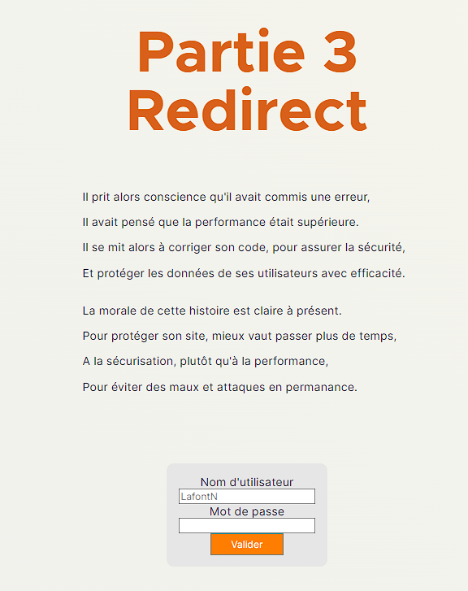
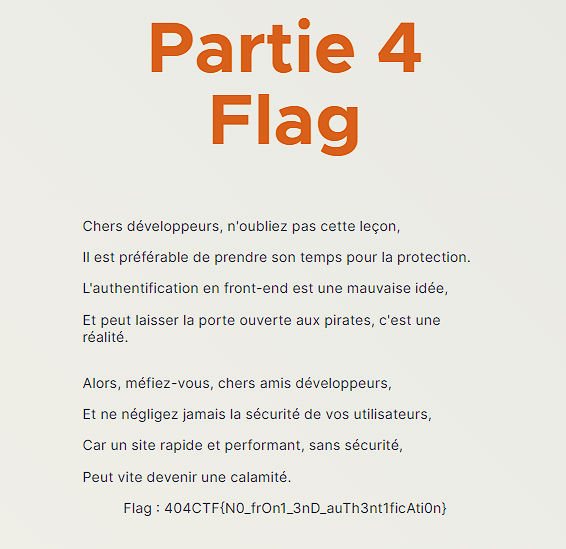

# Category - Challenge name

## Challenge description


## Resolution

On ouvre le lien https://le-loup-et-le-renard.challenges.404ctf.fr/.

On arrive tout d'abord sur une page d'accueil, et on accède de la à un page d'authentification.





On inspecte la page et on se rend compte que la fonction d'authentification est hardcodée :

```javascript
  // Système d'authentification
  function auth() {
    if (
      document.getElementById("username").value === "admin" &&
      document.getElementById("password").value === "h5cf8gf2s5q7d"
    ) {
      window.location.href = "/fable/partie-2-cookie";
    }
  }
```

On peut donc se connecter avec le nom d'utilisateur `admin` et le mot de passe `h5cf8gf2s5q7d`.


On accède ensuite à la partie 2, sur les Cookies.



On tente de se connecter, en interceptant la requête avec *Burp Suite*.

On voit dans la requête : `Cookie: isAdmin=false`. On va donc tenter de le modifier en `isAdmin=true`.

On arrive ensuite dans la partie 3 : Redirect.



On tente donc de se connecter, en interceptant la requête avec *Burp Suite*.

La page "Partie 4 : Flag" s'affiche alors.



*NB : dès qu'on redirect la requête, cette page disparait donc* :)

Le flag est `404CTF{N0_frOn1_3nD_auTh3nt1ficAti0n}`.