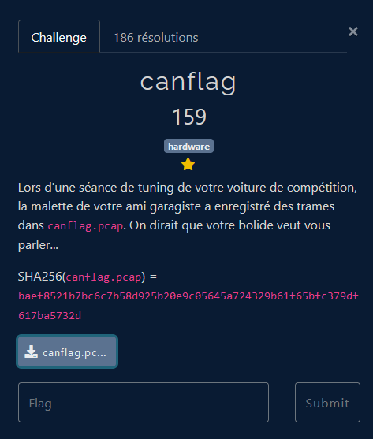

# Hardware

## Challenge description

## Résolution

On ouvre le fichier `.pcap` avec Wireshark. On a un seul type de trame, les trames CAN. Dans la colonne `info`, on voit deux types de trames : `STD` et `XTD`. On regarde sur internet, et on voit que ce sont des identifiants pour le protcole CAN. On voit aussi que les trames `XTD` sont des trames étendues, et que les trames `STD` sont des trames standards. On voit aussi des sortes de numéro. 

On se baladant dans le `.pcap`, on observe une premiere trame intéressante : 

    62	0.001161			CAN	16	FCSC	XTD: 0x00000002   46 43 53 43

En effet, le texte est "FCSC", donc le début du flag. On cherche ensuite s'il y a une autre trame qui commence par `{`, la suite du flag donc. On trouve :

    16	0.000361			CAN	72	{aa9e	STD: 0x00000002   7b 61 61 39 65

On remarque deux chose : les deux trames qui se suivent semblent ne pas être du même type (`STD` ou `XTD`), mais portent le même numéro. 

On va donc récupérer les trames dans l'ordre des numéro, en plaçant le texte des `XTD` en premier et celui des `STD` ensuite. On ignore les trames vides, et on obtient bien un flag qui fini par `}`. 

On obtient donc le flag !