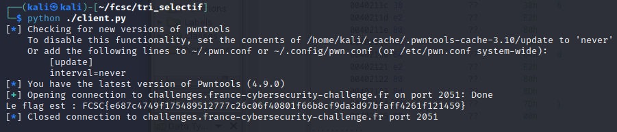

# Algo - Tri sélectif

## Challenge description

## Résolution

On a 2 fichier : `client.py`, qui contient des fonctions qui nous permettent d'envoyer des instructions au serveur :
- Comparer(x,y) qui retourne 1 si la valeur en X est inférieure ou égale à celle en Y, 0 sinon
- Echanger(x,y)
- Longueur()
- Verifier()

Et `tri_selectif.py`, qui contient le code du serveur. 

L'objectif est de compléter la fonction `trier(N)` du fichier `client.py`.

Il n'y a pas de limite d'efficacité, donc on peut utiliser l'algorithme suivant :

    def trier(N):
        for i in range(N):
            min_index = i
            for j in range(i+1, N):
                if comparer(j, min_index) == 1:
                    min_index = j
            if min_index != i:
                echanger(i, min_index)

On lance le script avec python, et on obtient :

