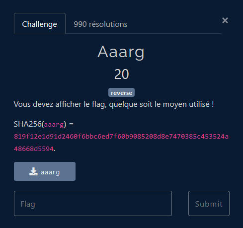
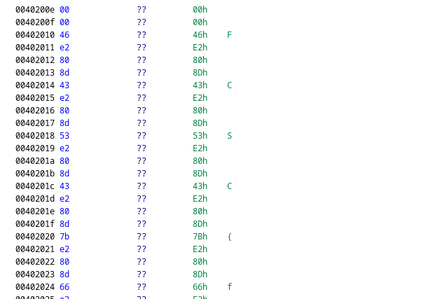

# Forensics - La Gazette Windows

## Challenge description

## Résolution

On va ouvrir le fichier avec Ghidra, vu que c'est du reverse, pour en savoir un peu plus.

On trouve un endroit avec `FCSC{`, on en déduit que le flag est dans le coin !

On récupère le flag (en parsant avec un petit script python), et on a le flag !