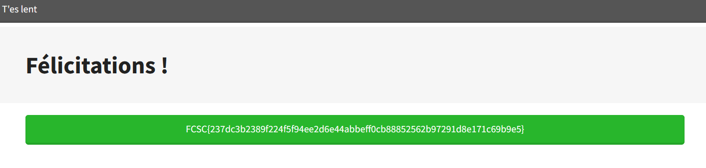

# Forensics - La Gazette Windows

## Challenge description

## Résolution

On a le lien vers le site [T'es lent](https://tes-lent.france-cybersecurity-challenge.fr/)

On arrive sur la page avec une offre de stage :

En utilisant inspecter l'élement, on trouve un bloc de code commenté :

On voit que ce code fait référenc à une page `/stage-generateur-de-nom-de-challenges.html`. On tente d'accèder à une page "mode brouillon, cette pas prête" :

On trouve un autre bloc de code commenté :

On y accède et paf, un suberbe flag !

