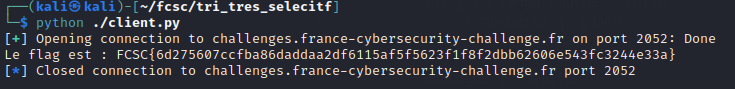

# Algo - Tri sélectif

## Challenge description

## Résolution

Ce challenge est une sorte de suite à [Algo - Tri selectif](../intro/Algo_tri_selectif.md), mais cette fois-ci, on doit être efficace : on a un nombre de comparaison limité.

Comme avant, on a 2 fichier : `client.py`, qui contient des fonctions qui nous permettent d'envoyer des instructions au serveur :
- Comparer(x,y) qui retourne 1 si la valeur en X est inférieure ou égale à celle en Y, 0 sinon
- Echanger(x,y)
- Longueur()
- Verifier()

Et `tri_tes_selectif.py`, qui contient le code du serveur. 

L'objectif est de compléter la fonction `trier(N)` du fichier `client.py`.

Comme nous sommes limité par le nombre de comparaison, on va utiliser l'algorithme Quicksort, qui est bien plus efficace que notre précédente implémentation de `trier()`.

    def trier(N):
        def quicksort(gauche, droite):
            if gauche >= droite:
                return
            pivot = droite
            i = gauche
            for j in range(gauche, droite):
                if comparer(j, pivot):
                    echanger(i, j)
                    i += 1
            echanger(i, droite)
            quicksort(gauche, i - 1)
            quicksort(i + 1, droite)

        quicksort(0, N - 1)

On lance le script avec python, et on obtient :

