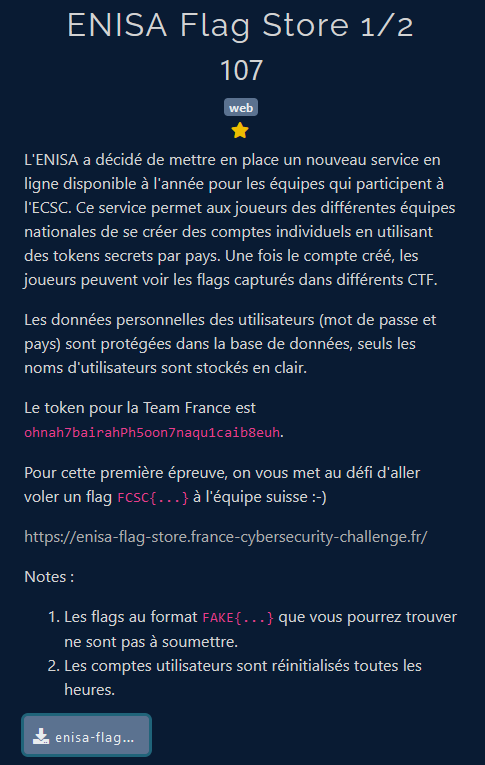
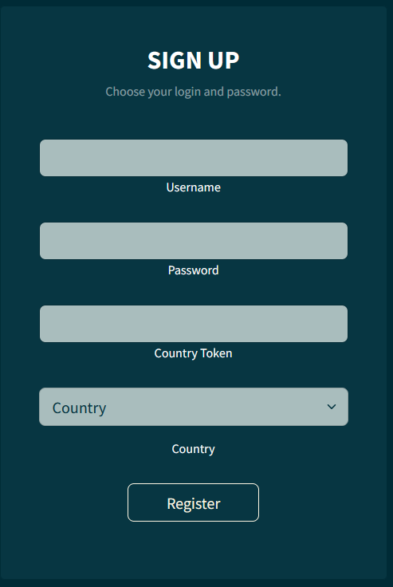
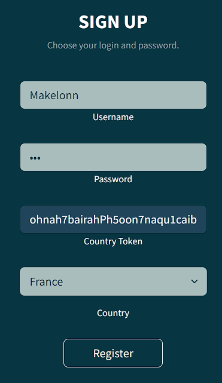
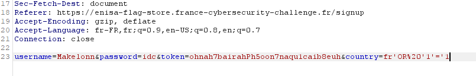
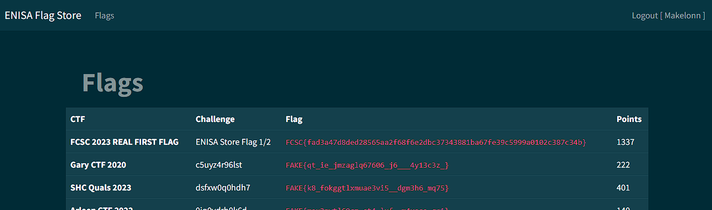

# Web - ENISA flag store 1 sur 2

## Challenge description



## Résolution

La première chose que j'ai faite, c'est me créer un compte sur le site. On voit alors qu'on a accès à une liste de flag FAKE{}. On suppose donc que le vrai flag va être retrouvé quelque part en lien avec les faux flags.

On a accès au code du site, donc on va regarder si on peut en faire quelque chose. On commence donc par regarder comment sont récupérés les flags. 

```php
func getData(user User) (
    []Flag,
    error,
) {
    var flags []Flag

    req := fmt.Sprintf(`SELECT ctf, challenge, flag, points
                        FROM flags WHERE country = '%s';`, user.Country);
    rows, err := db.Query(req);
    if err != nil {
        return flags, err
    }
    defer rows.Close()

    for rows.Next() {
        var flag Flag
        err = rows.Scan(&flag.CTF, &flag.Challenge, &flag.Flag, &flag.Points)
        if err != nil {
            return flags, err
        }
        flags = append(flags, flag)
    }
    if err = rows.Err(); err != nil {
        return flags, err
    }

    return flags, nil
}
```

On constate que la requête a la base de données n'est pas faite à l'aide de `Prepare`, et qu'on peut probablement faire une SQLi à l'aide du champ "Country". 

Le problème, c'est que ce n'est pas un champ qu'on peut modifier quand on crée un compte : c'est une liste déroulante.



L'autre problème, c'est que si on s'incrit avec un autre pays que la France, on est bloqués, car il faut le token correspondant au pays, donc on ne peux pas simplement récupérer le flag Suisse en créant un compte Suisse.

On va donc regarder comment se passe la création de compte dans le code. On voit que la correspondance token/pays est faite dans la fonction `CheckToken` :

```php
func CheckToken(country string, token string) (
    bool,
) {

    stmt, err := db.Prepare(`SELECT id FROM country_tokens
                             WHERE country = SUBSTR($1, 1, 2)
                             AND token = encode(digest($2, 'sha1'), 'hex')`)
    if err != nil {
        log.Fatal(err)
    }

    t := &Token{}
    err = stmt.QueryRow(country, token).Scan(&t.Id)
    if err != nil {
        return false
    }
    return true
}
```

En regardant cette fonction, on remarque que le pays est récupéré à l'aide de `SUBSTR($1, 1, 2)`, ce qui veut dire qu'on peut mettre n'importe quoi dans le champ "Country" et que seul les deux premiers caractères seront pris en compte.

Précèdemment, on a vu que l'ont pouvait probablement effectuer une SQLi à l'aide du champ "Country", on a désormais l'information qu'il suffit d'avoir "FR" pour les deux premiers caractères du pays pour que le token, et donc l'inscription soient validés.

Pour ce qui est du "problème" de la liste déroulante, on va utiliser l'outil *Burp Suite* pour intercepter la requête d'inscription et la modifier. 

Dans l'onglet Proxy, on ouvre le navigateur de Burp. On se créée un compte, et on intercepte la requête d'inscription. 



 

On encode en URL `FR' OR '1'='1`, condition qui sera donc toujours vraie. On remplace donc `FR` par `fr'%20OR%20'1'='1` dans la requête, et on la renvoie.

Une fois qu'on se connecte avec ce compte, on voit le flag apparaître en haut :

