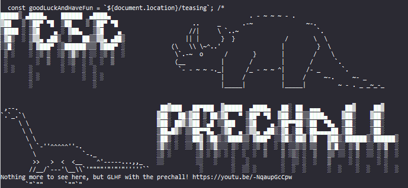
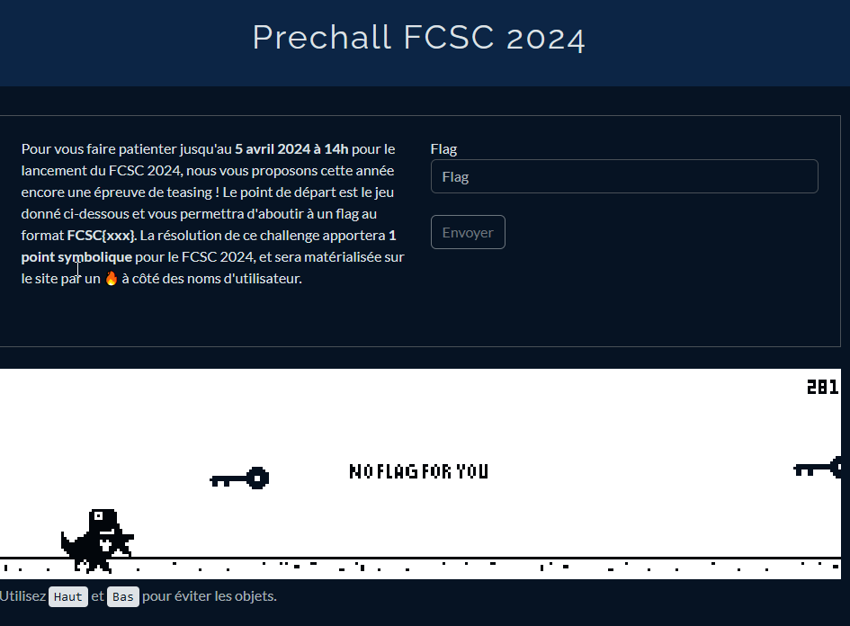
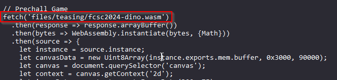
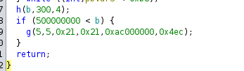
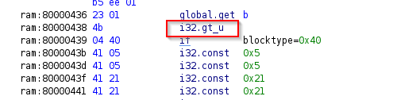
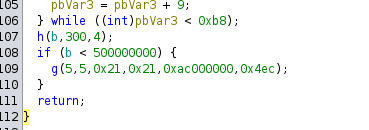
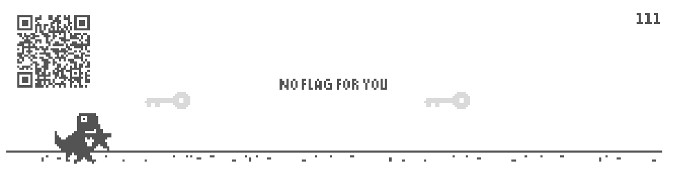
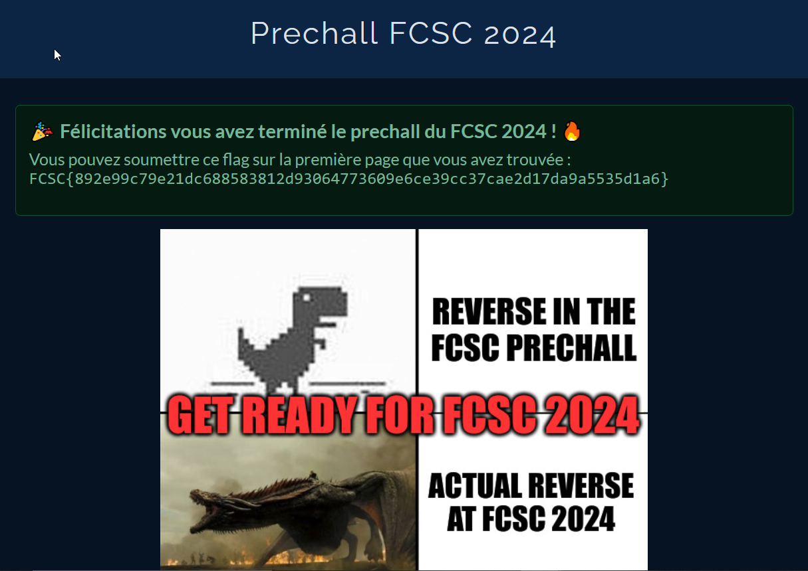

# Prechall

## Description

This challenge is a pre-challenge, to keep us waiting until the start of the CTF. Therefore, the challenge is hidden. When inspecting the main page, we can find this script :



The first step is obviously to listen to the theme from jurassic park linked in the script. Once it is done, the next step is to access the hidden page `/teasing`:



## Solution

### Reverse 

We can get the `.wasm` file. The link to access this file is in the script : 



Now, we can download the file and decompile it with `ghidra`.
When we look at the main, this part seems interesting. It looks a lot like an impossible score to get, which match the idea of this challenge (at least, as i understood it). 



The idea is to switch the `500000000 < b` with `500000000 > b`. If this is the condition to win, then we will win imeediately. To do so, we change `i32.lt_s` with `i32.gt_s` in the `.wasm` file.



After modifiction using the `patch` option of ghidra, the main is now :



It is indeed what we wanted. Now, we want to actually run the edited file. To do so, I used `Hex editor` in `vscode` to edit the file. As ghidra display the updated hex (`4b`), it was easy. After saving the modification, I openned the file :



It was indeed the winning condition we edited (lucky me, because it was the first thing i tested)! We now have a QRCode. 


When scanning the QR code, we get the following link `https://france-cybersecurity-challenge.fr/bded79a9edb3e51a1d752c5ea6dfae1a`.

### Programming

We find the script (see `found_script.py`).

We can modify this script to inverse the requirment for the input. The script used to craft the string from the conditions is the following :

```python
from hashlib import sha256

CHARSET = "ABCDEFGHIJKLMNOPQRSTUVWXYZabcdefghijklmnopqrstuvwxyz!?€$*"
L1 = "$ABFIZht!HPUYhirKOXdhjxy?DGJSWehCENahklo*cghmpu€MQRVfhvzLTbhnqsw"
L2 = "!FOWamwzFRSTUdlp*EFVXbei?FMNPgjsCDFHcnvxFJQYkqy€FGKLforu"
L3 = "!FOWamwz$RcejkrwDIKNVYpwGHMXltw€*APSovwy?BCQdiuwEJUZfgwx"

def check(A, B):
    #There is 2 parts in this function; which works similarly
    # If even one time the check len(s) == 1 is False, the function will return False

    # First part :
    res = True
    for a in range(7):
        for b in range(7):
            S = set(A[a])
            for x in range(7):
                y = (a * x + b) % 7

                # Modification of B to make it match the requirements
                tmpS = S.intersection(set(B[y][x]))
                if len(tmpS) != 1:
                    # If the intersection is not of size 1, we replace the 0 in B[y][x] by the only element in S
                    # That way the intersection is of size 1 when we update S just after
                    B[y][x] = B[y][x].replace("0", list(S)[0], 1)
                S = S.intersection(set(B[y][x]))
                # We sort the characters in B[y][x] as it is required by an assertion
                B[y][x] = "".join(sorted(B[y][x]))
            #This line was pertubarting ( res &= (len(S) == 1) ) so i changed it
            if (len(S) != 1):
                res = False
            
                
    # Second part :
    # It work the same way as the first part
    for x in range(7):
        S = set(A[7])
        for y in range(7):
            # Modification of B to make it match the requirements
            tmpS = S.intersection(set(B[y][x]))
            if len(tmpS) != 1:
                B[y][x] = B[y][x].replace("0", list(S)[0], 1)
            S = S.intersection(set(B[y][x]))
            # Sorting B
            B[y][x] = "".join(sorted(B[y][x]))

        # res &= (len(S) == 1) which is equivalent to :
        if (len(S) != 1):
            res = False
    return res

# The user input is what should be used as an input string, but we are gonna compute it in the script
#s = input(">>> ")

# First, our input will be of size 456 because of the assert. Also, we use char 0 that is not in the charset
s = '0' * (456)
#assert len(s) == 456 # -> S of size 456
#assert all(x in CHARSET for x in s) # -> all chars of S are in the charset

# Now, we can etermine the first 64 chars of S : it is s1, wich compose A, and the assert tells us that "".join(A) == L1
# Therefore, the beginning of S is L1
#assert L1 == "".join(A)
s = '$ABFIZht!HPUYhirKOXdhjxy?DGJSWehCENahklo*cghmpu€MQRVfhvzLTbhnqsw' + s[64:]
s1, s2 = s[:64], s[64:] # -> s1 is the first 64 chars of S, and s2 the rest
# Splitting s1 into chunks of 8 characters
A = [ s1[j:j + 8] for j in range(0, 64, 8) ] # should be ['$ABFIZht', '!HPUYhir', 'KOXdhjxy', '?DGJSWeh', 'CENahklo', '*cghmpu€', 'MQRVfhvz', 'LTbhnqsw']
# Splitting s2 into chunks of 8 characters within chunks of 56 characters (which will be full of 0 for now)
B = [ [s2[i:i + 56][j:j + 8] for j in range(0, 56, 8) ] for i in range(0, len(s2), 56)]

# Now, on to B : we can determine some chars using the follwing assertions :
assert L2 == "".join([ B[0][i] for i in range(7) ]) # -> B[0][i] are ['!FOWamwz', 'FRSTUdlp', '*EFVXbei', '?FMNPgjs', 'CDFHcnvx', 'FJQYkqy€', 'FGKLforu']
assert L3 == "".join([ B[i][0] for i in range(7) ]) # -> B[i][0] are ['!FOWamwz', '$Rcejkrw', 'DIKNVYpw', 'GHMXltw€', '*APSovwy', '?BCQdiuw', 'EJUZfgwx']
# Let's fill B according to this. Now, B[0][i] and B[i][0] are known, but the rest is still full of 0
tmp = ['!FOWamwz', 'FRSTUdlp', '*EFVXbei', '?FMNPgjs', 'CDFHcnvx', 'FJQYkqy€', 'FGKLforu']
tmp2 =['!FOWamwz', '$Rcejkrw', 'DIKNVYpw', 'GHMXltw€', '*APSovwy', '?BCQdiuw', 'EJUZfgwx']
for i in range(7):
    B[0][i] = tmp[i]
    B[i][0] = tmp2[i]

# Now, we can fill the rest of B using the check function (cf in the function)
# assert all([ sorted(B[i][j]) == list(B[i][j]) for i in range(7) for j in range(7) ]) # -> all chars of B are sorted, which is done in the check function
assert check(A, B)


# Reverse the way we built A and B to get the S we should have entered
s = "".join(A) + "".join([ "".join(B[i][j]) for i in range(7) for j in range(7) ])
h = sha256(s.encode()).hexdigest()
print(f"Congrats! You can now go here: https://france-cybersecurity-challenge.fr/{h}")
```
We run the script, and we get the link : `https://france-cybersecurity-challenge.fr/b476ca7cd889ee0d2de7db528f2cc094329be7da417d10a24a808997825fff90`

We access the link :




Which gives us :

- The flag : FCSC{892e99c79e21dc688583812d93064773609e6ce39cc37cae2d17da9a5535d1a6}
- A feeling that i will no shine in reverse this year either :'(