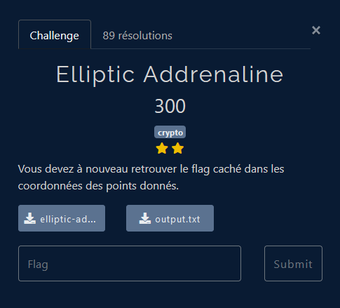

# Crypto - Elliptic Addrenaline

## Challenge description



## Résolution

Ce challenge est une suite du challenge [Elliptic Addventure](./elliptic_addventure.md). On réutilise les même principes.

On a deux fichiers : un fichier `.sage`, qui est un langage basé sur python pour des utilisations mathématiques, et un fichier `.txt` qui contient l'output de ce fichier. En lisant le fichier `.sage`, on voit que l'outpout a été générée en se basant sur le flag. 

On a A et B, deux points d'une courbe elliptique. On connait (A+B) et (A-b).  On sait, grâce au fichier `.sage`, qu'on cherche les coordonnées x de A et B :

```python
    Ax = K(bytes_to_long(flag[:mid]))
    Bx = K(bytes_to_long(flag[mid:]))
```

On peut faire le calcul de 

```latex
    (A+B) + (A-B) = 2A
    (A+B) - (A-B) = 2B
```

Pour trouver A et B, il faut ensuite multiplier par l'inverse de 2 dans le corps K. La grosse différence avec le challenge précédent, c'est que les divisions ont deux solutions. On va donc tester les 4 combinaisons possibles pour trouver la solution qui affiche le flag.

```python
from Crypto.Util.number import long_to_bytes


p = 2**255 - 19
a = 19298681539552699237261830834781317975544997444273427339909597334573241639236
b = 55751746669818908907645289078257140818241103727901012315294400837956729358436


K = GF(p)
E = EllipticCurve([K(a), K(b)])

x = K(2)
x_inv = 1 / x


AplusB = E(36383477447355227427363222958872178861271407378911499344076860614964920782192,26621351750863883655273158873320913584591963316330338897549941610801666281894,1)
AmoinsB = E(35017143636654127615837925410012912090234292410137109973033835965781971515338,55888666729705323990488128732989325970476008697224551268788692630541877244410,1)

deuxA = AplusB + AmoinsB
deuxB = AplusB - AmoinsB

Aa = deuxA.division_points(2)[0]
Ab = deuxA.division_points(2)[1]
Ba = deuxB.division_points(2)[0]
Bb = deuxB.division_points(2)[1]


Axa = Aa.xy()[0]
Axb = Ab.xy()[0]
Bxa = Ba.xy()[0]
Bxb = Bb.xy()[0]

print(long_to_bytes(ZZ(Axa))+long_to_bytes(ZZ(Bxa)))
print(long_to_bytes(ZZ(Axa))+long_to_bytes(ZZ(Bxb)))
print(long_to_bytes(ZZ(Axb))+long_to_bytes(ZZ(Bxa)))
print(long_to_bytes(ZZ(Axb))+long_to_bytes(ZZ(Bxb)))

```

On obtient alors 4 solutions :

```python
b'=st*\xf3nB\xdf\x8aj{\xdfd\x8f\xb7*`~\x1f\x9b\xd0\x17\xa5i\xdd26\x82\xb1\xc9\xba\xc6f46d8961b60dff4b187ef6fe4f09e34}'
b"=st*\xf3nB\xdf\x8aj{\xdfd\x8f\xb7*`~\x1f\x9b\xd0\x17\xa5i\xdd26\x82\xb1\xc9\xba\xc6px$\xfd$\xe8Q\xce\xcb\x08'4\x0e'\x95$\xfeP\xf5\x0e\xe9\x82R\xd0t\x89\x1c\xdf\xe7~\xeel"
b'FCSC{1f0b8b8d4ff304004126f245ee5f46d8961b60dff4b187ef6fe4f09e34}'
b"FCSC{1f0b8b8d4ff304004126f245ee5px$\xfd$\xe8Q\xce\xcb\x08'4\x0e'\x95$\xfeP\xf5\x0e\xe9\x82R\xd0t\x89\x1c\xdf\xe7~\xeel"
```

On identifie facilement le flag comme le x de la deuxième solution de A et de la première solution de B.

On obtient alors : `FCSC{1f0b8b8d4ff304004126f245ee5f46d8961b60dff4b187ef6fe4f09e34}`.