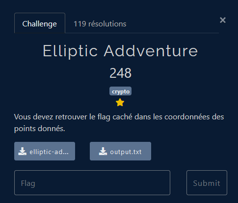

# Crypto - Elliptic Addventure

## Challenge description



## Résolution

On a deux fichiers : un fichier `.sage`, qui est un langage basé sur python pour des utilisations mathématiques, et un fichier `.txt` qui contient l'output de ce fichier. En lisant le fichier `.sage`, on voit que l'outpout a été générée en se basant sur le flag. 

On a A et B, deux points d'une courbe elliptique. On connait (A+B) et (A-b).  On sait, grâce au fichier `.sage`, qu'on cherche les coordonnées x de A et B :

```python
    Ax = K(bytes_to_long(flag[:mid]))
    Bx = K(bytes_to_long(flag[mid:]))
```

On peut faire le calcul de 

```latex
    (A+B) + (A-B) = 2A
    (A+B) - (A-B) = 2B
```

Pour trouver A et B, il faut ensuite multiplier par l'inverse de 2 dans le corps K. 

```python
    x = K(2) #2, dans le corps K
    x_inv = 1/x #inverse de 2 dans le corps K
```

Ensuite, on reprend nos (A+B) et (A-B), pour retrouver 2A et 2B :

```python
    AplusB = E(65355407912556110148433442581541116153096561277895556722873533689053268966181,105815222725531774810979264207056456440531378690488283731984033593201027022521,1)
    AmoinsB = E(103762781993230069010083485164887172361256204634523864861966420595029658052179,76878428888684998206116229633819067250185142636730603625369142867437006615111,1)

    deuxA = AplusB + AmoinsB
    deuxB = AplusB - AmoinsB
```

A partir de la, on multiplie 2A et 2B par l'inverse de 2 dans le corps K, pour retrouver A et B, puis on récupère les coordonnées en x de A et B, pour retrouver le flag. Dans notre cas, il n'y a qu'une seule solution pour les deux divisions, donc on peut directement prendre le premier élément de la liste retournée par la fonction `division_point(2)`.

```python
    A = deuxA.division_point(2)[0]
    B = deuxB.division_point(2)[0]

    Ax = A.xy()[0]
    Bx = B.xy()[0]

    print(long_to_bytes(ZZ(Ax))+long_to_bytes(ZZ(Bx)))
```

On obtient alors : `FCSC{a0c43dbbfaac7a84b5ce7feb81d492431a69a214d768aa4383aabfd241}`.

Le code complet :

```python
from Crypto.Util.number import long_to_bytes


p = 115792089210356248762697446949407573530086143415290314195533631308867097853951
a = -3
b = 41058363725152142129326129780047268409114441015993725554835256314039467401291


K = GF(p)
E = EllipticCurve([K(a), K(b)])

x = K(2)
x_inv = 1 / x

AplusB = E(65355407912556110148433442581541116153096561277895556722873533689053268966181,105815222725531774810979264207056456440531378690488283731984033593201027022521,1)
AmoinsB = E(103762781993230069010083485164887172361256204634523864861966420595029658052179,76878428888684998206116229633819067250185142636730603625369142867437006615111,1)

deuxA = AplusB + AmoinsB
deuxB = AplusB - AmoinsB

A = deuxA.division_points(2)[0]
B = deuxB.division_points(2)[0]

Ax = A.xy()[0]
Bx = B.xy()[0]

print(long_to_bytes(ZZ(Ax))+long_to_bytes(ZZ(Bx)))
```