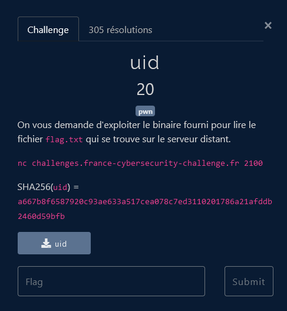
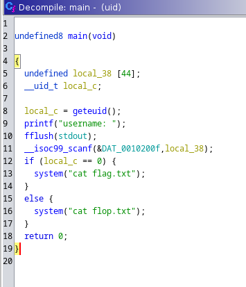
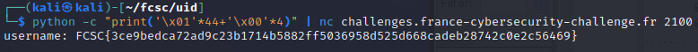

# Pwn - uid

## Challenge description

## Résolution

On ouvre l'executable `uid` avec Ghidra, afin d'essayer de comprendre ce qu'il fait, ou de trouver des informations.

On récupère la fonction main :

On voit que la variable `local38` contient 44 charactère, et que `local_c` contient l'uid. Selon le code du main, si l'uid est 0 (donc la valeyur dans `local_c` est 0), alors le programme affiche le flag.

On va donc chercher un moyen de modifier la valeur de `local_c` à 0.

On voit que les 2 variables sont dans le stacks (le tableau et constant et le `local_c = getuid()` permet de déduire la même chose pour `local_c`). Donc les deux variables sont stockées à la suite. Il n'y a pas de vérification de la taille de l'username qui va être copié dans le tableau, donc on peut écrire plus de 44 charactères, et écrire dans `local_c`.

On va donc faire un buffer overflow, en écrivant 44 charactères, puis en écrivant 0 dans `local_c`.

On peut utiliser un commande python pour générer le payload et le tester avec l'executable en local :

    python -c "print('\x01'*44+'\x00'*4)" | ./uid

On fait la même chose avec le netcat :

