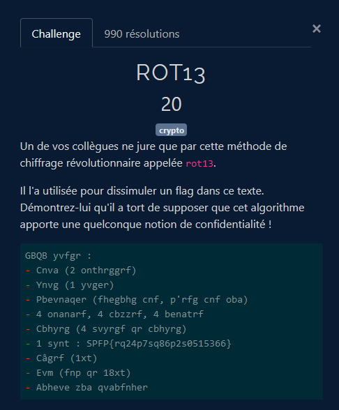

# Crypto - ROT13

## Challenge description

## Résolution

On a le texte suivant :
    GBQB yvfgr :
    - Cnva (2 onthrggrf)
    - Ynvg (1 yvger)
    - Pbevnaqer (fhegbhg cnf, p'rfg cnf oba)
    - 4 onanarf, 4 cbzzrf, 4 benatrf
    - Cbhyrg (4 svyrgf qr cbhyrg)
    - 1 synt : SPFP{rq24p7sq86p2s0515366}
    - Câgrf (1xt)
    - Evm (fnp qr 18xt)
    - Abheve zba qvabfnher

ROT13 est un chiffrement connu : le code César, ou chiffrement par décalage. On peut utiliser un site comme [dcode](https://www.dcode.fr/chiffre-rot-13) pour le décoder. On obtient alors :

    TODO liste :
    - Pain (2 baguettes)
    - Lait (1 litre)
    - Coriandre (surtout pas, c'est pas bon)
    - 4 bananes, 4 pommes, 4 oranges
    - Poulet (4 filets de poulet)
    - 1 flag : FCSC{ed24c7fd86c2f0515366}
    - Pntes (1kg)
    - Riz (sac de 18kg)
    - Nourir mon dinosaure